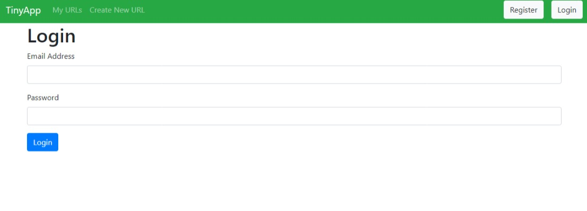

# TinyApp Project

**TinyApp** is a full-stack web application created using Node.js and Express. It offers users the ability to shorten long URLs, similar to popular services like bit.ly.

## Preview




## Features

- Shorten long URLs to make them more manageable.
- View a list of URLs created by the user.
- Edit and update existing URLs.
- Secure user authentication and password hashing.
- Session-based user management.

## Technology Stack

- **Node.js**: A powerful JavaScript runtime for server-side development.
- **Express**: A fast and minimalist web framework for Node.js, ideal for building web applications and APIs.
- **EJS**: A template engine for rendering dynamic HTML content.
- **bcryptjs**: A library for securely hashing passwords.
- **cookie-session**: Middleware for handling session cookies.

## Getting Started

To set up and run TinyApp on your local machine, follow these simple steps:

1. **Install Dependencies**: Start by installing all project dependencies. Run the following command in your terminal:

   ```bash
   npm install
   ```

2. **Start the Development Server**: Launch the development web server by running:

   ```bash
   node express_server.js
   ```

   Your TinyApp will be accessible at `http://localhost:8080/`.

That's it! You're all set to explore and use TinyApp. Enjoy shortening those URLs!